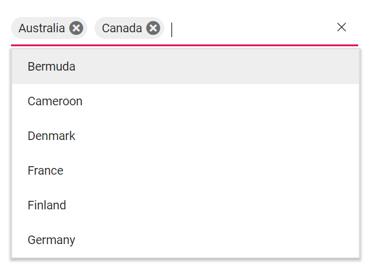

# Syncfusion Angular 7 MultiSelect Dropdown Quick Start Project

A quick start project that helps you to create the Syncfusion Angular 7 MultiSelect Dropdown with minimal code configuration.



## MultiSelect Dropdown features covered in this Project

This is an Angular 7 project created using [Angular CLI](https://github.com/angular/angular-cli) 7.0.4. The MultiSelect Dropdown features included in this project are as follows.
* Angular 7 MultiSelect Dropdown initialization.
* Data binding to the MultiSelect Dropdown.
* Setting the value on initial rendering.
* Getting the value on button submit action.

## How to run this application?
To run this application, you need to first clone the `ej2-angular-7-multiselct-dropdown` repository and then navigate to its appropriate path where it has been located in your system.

To do so, open the command prompt and run the below commands one after the other.

```
git clone https://github.com/SyncfusionSamples/ej2-angular-7-multiselct-dropdown.git
cd ej2-angular-7-multiselct-dropdown
```

## Installing
Once done with downloading, next you need to install the necessary packages required to run this application locally. The `npm install` command will install all the needed angular packages into your current project and to do so, run the below command.

```
npm install
```
## Running on development server
Run `ng serve` for a dev server. Navigate to `http://localhost:4200/`. The app will automatically reload if you change any of the source files.

## Further help

To get more help on the Angular CLI use `ng help` or go check out the [Angular CLI README](https://github.com/angular/angular-cli/blob/master/README.md).